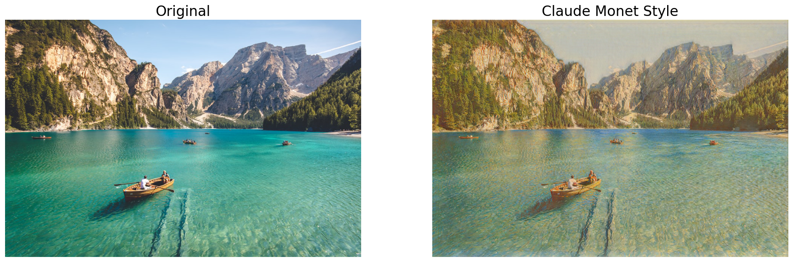
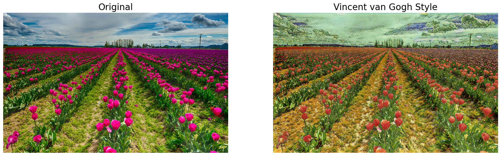
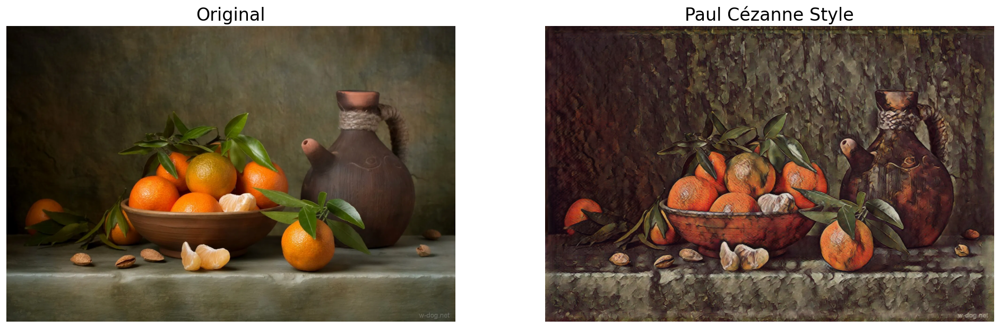
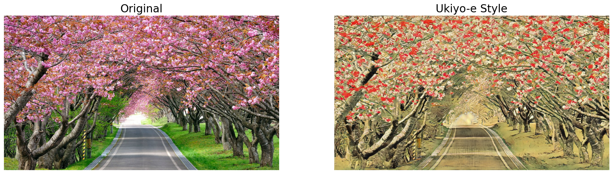
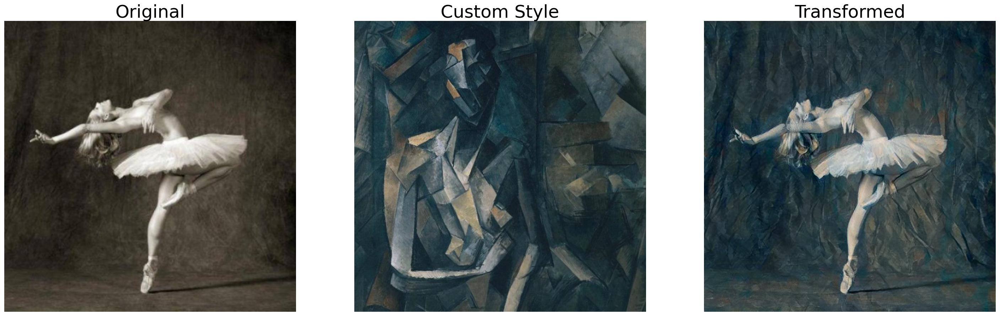

# Neural Style Transfer

## Table of Contents:
- [Introduction](#Introduction)
- [DL Techniques](#DL-Techniques)
- [Architecture](#Architecture)
  - [Model Application](#Model-Application)
  - [Telegram Bot Application](#Telegram-Bot-Application)
- [Installation](#Installation)

## Introduction

This is the final project of the computer vision course powered by
["Deel Learning School"](https://www.dlschool.org/)
that took place in the spring of 2022.

The main goal of the project is to make it possible to change the style
of any image using deep learning techniques.

## DL Techniques

There are two core technologies that were used to achieve the goal.

The first one is the
["Neural-Style Algorithm"](https://arxiv.org/abs/1508.06576)
developed by Leon A. Gatys, Alexander S. Ecker and Matthias Bethge.
In a nutshell, the algorithm allows you to take any image and reproduce it
with the artistic style of another image. The main advantage of the algorithm
is the ability to transfer a custom style without being trained on a huge dataset
though it still needs a pre-trained model (e.g. one from ```torchvision.models```)
to start the work.

The second technology is the ["CycleGAN"](https://arxiv.org/abs/1703.10593)
developed by Jun-Yan Zhu, Taesung Park, Phillip Isola and Alexei A. Efros.
This approach for learning allows you to translate an image from a source domain X
to a target domain Y in the absence of paired examples. It makes it possible to
train models in case a paired dataset is expensive to get or it doesn't even exist.

But there's never a free lunch so let’s mention the main drawbacks
of both approaches:
- neural-style algorithm doesn't need to be trained, but it is very time-consuming 
when it comes to inference, which is crucial if you want to handle many images on the go
- in contrast, CycleGAN inference time is low, but the training process is very long and
computational expensive. Afterwards you only get one style per model.

## Architecture

The project itself consists of two applications:
- [model application](model_app) is used to transfer the style from one image to another
- [telegram bot application](bot_app) is used to communicate with users

In order not to reinvent the wheel, some code snippets from the following sources
were adapted to the goal of the project:
- [pytorch neural style tutorial by Alexis Jacq and Winston Herring](https://pytorch.org/tutorials/advanced/neural_style_tutorial.html)
- [pytorch "CycleGAN" implementation by Jun-Yan Zhu, Taesung Park and Tongzhou Wang](https://github.com/junyanz/pytorch-CycleGAN-and-pix2pix)

### Model Application

This is just a ["Flask"](https://flask.palletsprojects.com/) application that receives
images to be transformed using HTTP requests and send the result back.

The application uses [pretrained](https://github.com/junyanz/pytorch-CycleGAN-and-pix2pix)
["CycleGAN"](https://arxiv.org/abs/1703.10593) models
to perform fast style transfer, but the number of styles are limited.
Currently, the four preset styles are available:
- Claude Monet



- Vincent van Gogh



- Paul Cézanne



- Ukiyo-e



It's also possible to transfer the unique style of any image using the
["Neural-Style Algorithm"](https://arxiv.org/abs/1508.06576) though
it's time-consuming and requires the image to be cropped:



### Telegram Bot Application

This is a fully asynchronous bot that uses the official [HTTP-based API](https://core.telegram.org/bots/api)
to communicate with users via the ["Telegram" messanger](https://telegram.org/).

The bot leads a user through the chat script to get required information:
- style to be transferred
- images to apply the style to

Afterwards it sends the received information to the model application and awaits the result.
When the result is ready, the bot sends it back to the user.

## Installation

- Clone this repo:
```bash
git clone https://github.com/dypetrishchev/neural-style-transfer
cd neural-style-transfer
```

- Install python requirements:
```bash
pip install -r requirements.txt
```

- Set the bot [authentication token](https://core.telegram.org/bots) in the
["config.yaml"](bot_app/config.yaml):
```yaml
bot_app:
  # unique api token of the telegram bot
  api_token: "PUT YOUR TOKEN HERE"
```

- Run both applications:
```bash
source run.sh
```

- In the end stop both applications:
```bash
source stop.sh
```
